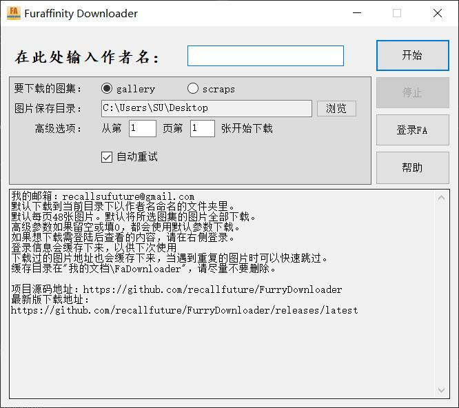

# Furry批量下载器
用于根据作者名批量下载[furaffinity](http://www.furaffinity.net)网站的图片。

## 界面

## 使用方法
打开后填入作者名，选择图片存放位置和图集后即可开始下载。默认为下载此作者的所有图片。

部分作者的内容需登陆后才可查看，请先在右侧登录。

登录信息会缓存下来，以供下次使用

下载过的图片地址也会缓存下来，当遇到重复的图片时可以快速跳过。

缓存目录在"我的文档\FaDownloader"，请尽量不要删除。

-----------

引用代码：[HttpHelper.cs](http://www.sufeinet.com/thread-3-1-1.html)
